<div id="top"></div>


<!-- PROJECT LOGO -->
<h1 align="center">AI Red Rose Counting System Web Application</h1>
<br />
<div align="center">
  <a href="https://github.com/Leo-Thomas/AI-based-red-rose-counting-webapp">
    
  </a>


  <p align="center">
    Web application that recognizes and counts the number of red roses using an artificial intelligence model.
    <br />
    <a href="https://github.com/Leo-Thomas/Yachay-Tech-object-detection-projects.git"><strong>Explore the docs »</strong></a>
    <br />
    <br />
  </p>
</div>


<!-- TABLE OF CONTENTS -->
<details>
  <summary>Table of Contents</summary>
  <ol>
    <li>
      <a href="#about-the-project">About The Project</a>
      <ul>
        <li><a href="#built-with">Built With</a></li>
        <li><a href="#os-suported">Os Suported</a></li>
      </ul>
    </li>
    <li>
      <a href="#getting-started">Getting Started</a>
      <ul>
        <li><a href="#prerequisites">Prerequisites</a>
                    <ul>
        <li><a href="#windows">Windows</a></li>
        <li><a href="#linux">Linux</a></li>
      </ul></li>
        <li><a href="#installation">Installation</a>
            <ul>
        <li><a href="#windows">Windows</a></li>
        <li><a href="#linux">Linux</a></li>
      </ul>
        </li>
      </ul>
    </li>
    <li><a href="#usage">Usage</a>
    <ul>
        <li><a href="#counting-by-uploading-a-file">Uploading a file</a></li>
        <li><a href="#counting-using-the-camera">Using the camera</a></li>
      </ul>
    </li>
    <li><a href="#contact">Contact</a></li>
    <li><a href="#acknowledgments">Acknowledgments</a></li>
  </ol>
</details>


<!-- ABOUT THE PROJECT -->
## About The Project

[![Product Name Screen Shot][product-screenshot]](https://example.com)

This is a web application that recognizes and counts the number of red roses using artificial intelligence. The user can upload an image or take a picture with the camera. Once the image is processed, the application will display on screen the number of roses found and the average accuracy. The user can also download the resulting image, or generate and download a report.

This web application was developed by Leo, Mike, Carlos and Juan, students at Yachay Tech University.

<p align="right">(<a href="#top">back to top</a>)</p>


### Built With

* [HTML](https://html.spec.whatwg.org/multipage/)
* [CSS](https://www.w3.org/Style/CSS/Overview.en.html)
* [JavaScript](https://www.javascript.com/)
* [Python](https://www.python.org/)
* [Django](https://www.djangoproject.com/)
* [Bootstrap](https://getbootstrap.com)
* [TensorFlow](https://www.tensorflow.org/)
* [ReportLab](https://www.reportlab.com/)

### OS Suported

* Microsoft Windows: 10, 11
* Linux: Ubuntu 20.04

<p align="right">(<a href="#top">back to top</a>)</p>

### Important considerations

<!-- GETTING STARTED -->
## Getting Started

### Prerequisites

* Python (3.8.8 recomended)
  
  [Download Python](https://www.python.org/downlyyyyykoads/)
* Notes: 
  1. Clic the option "Add Python to PATH"
  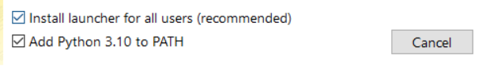
  
  2. Sometimes, there is an error about "Maximum Path Length Limitation" on Windows in the installation of TensorFlow. Follow the next <a href='https://docs.microsoft.com/en-us/windows/win32/fileio/maximum-file-path-limitation?tabs=powershell#enable-long-paths-in-windows-10-version-1607-and-later'>link</a> for the solution.
  3. 
#### Windows

* Latest pip
  ```sh
  pip install --upgrade pip
  ```
* Numpy
  ```sh
  pip install numpy
  ```  
* Django
  ```sh
  pip install django
  ```
* TensorFlow
  ```sh
  pip install tensorflow
  ```
* OpenCV
  ```sh
  pip install opencv-python
  ```
* ReportLab
  ```sh
  pip install reportlab
  ```
* Pillow
  ```sh
  pip install pillow
  ```
  
#### Linux

* Upgrade Repositories
  ```sh
  sudo apt-get upgrade -y
  ```
* Pip for Python3
  ```sh
  sudo apt install python3-pip
  ```
* Upgrade Pip for Python3
  ```sh
  sudo pip3 install --upgrade pip
  ```
* Django
  ```sh
  sudo pip3 install django
  ```
* TensorFlow
  ```sh
  sudo pip3 install tensorflow
  ```
* OpenCV
  ```sh
  sudo pip3 install opencv-python
  ```
* ReportLab
  ```sh
  sudo pip3 install reportlab
  ```
* Pillow
  ```sh
  sudo pip3 install pillow
  ```

### Installation


#### Windows


1. Clone the main repository
   ```sh
   git clone https://github.com/Leo-Thomas/Yachay-Tech-object-detection-projects.git
   ```
2. Inside "Web-Dev-Team" directory (`Yachay-Tech-object-detection-projects\Web-Dev-Team`), open a terminal as administrator and initialize the server 
   ```sh
   python manage.py runserver
   ```
3. Open the generated link in the browser
   ```sh
   Starting development server at **http://127.0.0.1:8000/**
   ```
  
<p align="right">(<a href="#top">back to top</a>)</p>
  


#### Linux

1. Clone the main repository
    ```sh
    sudo git clone https://github.com/Leo-Thomas/Yachay-Tech-object-detection-projects.git
    ```
2. Inside "Web-Dev-Team" directory (`Yachay-Tech-object-detection-projects\Web-Dev-Team`), open a terminal as administrator and initialize the server
    ```sh
    sudo python3 manage.py runserver
    ```
3. Open the generated link in the browser
    ```sh
    Starting development server at **http://127.0.0.1:8000/**
    ```
  
<p align="right">(<a href="#top">back to top</a>)</p>


<!-- USAGE EXAMPLES -->
## Usage

### Counting by uploading a file 

* Click the "Choose file" button


* Select the file you want to process and upload it

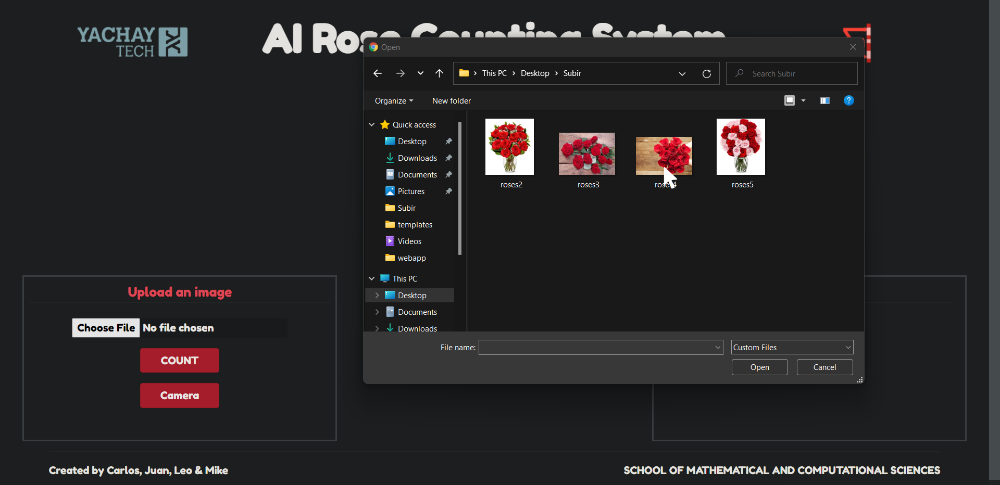

* Once the file is loaded, click the "Count" button to start counting.

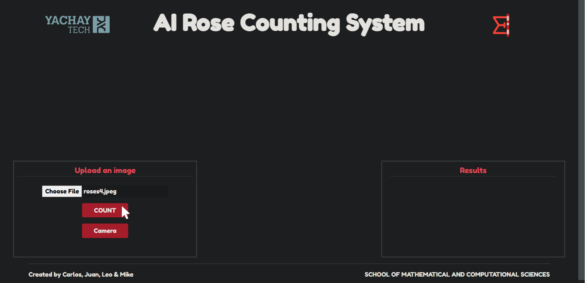

* A waiting screen will be displayed while your image is being processed. (_You can cancel the process at any time by clicking the "Cancel" button._)

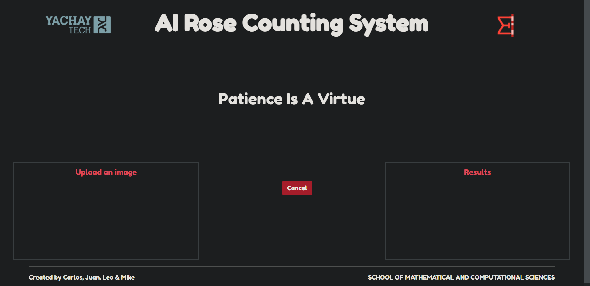

* After a few seconds, the original image will be displayed on the screen together with the image with the rose detection. Also, the number of roses found and the average accuracy will be displayed in the results panel.

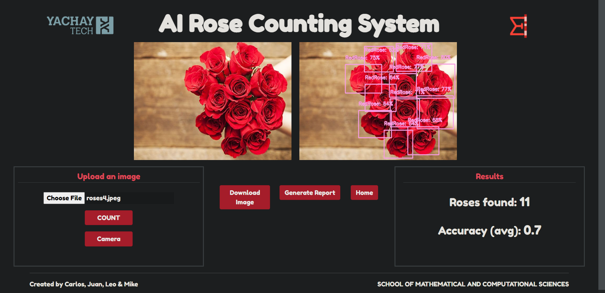

* If you wish, you can download the resulting image by clicking on the "Download Image" button.

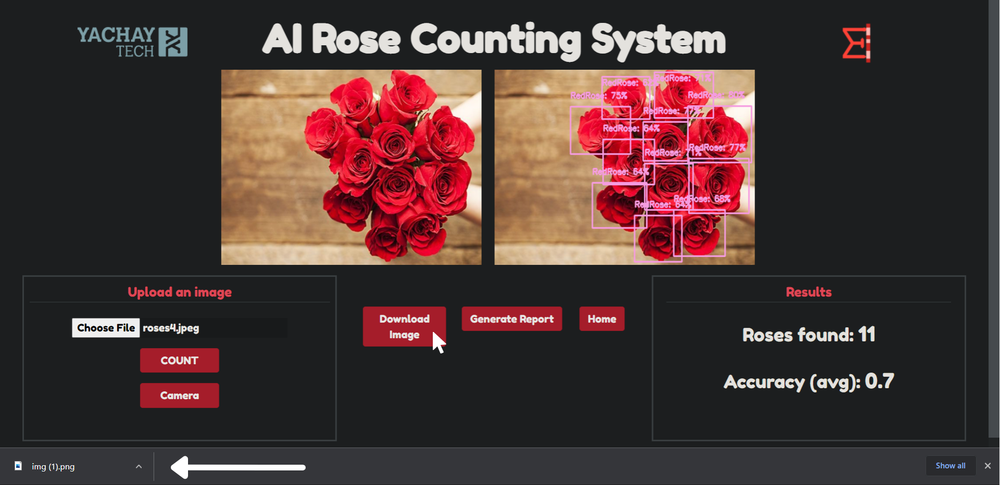


* You can also generate a report of the count by clicking on the "Generate report" button, which will take you to a new window.

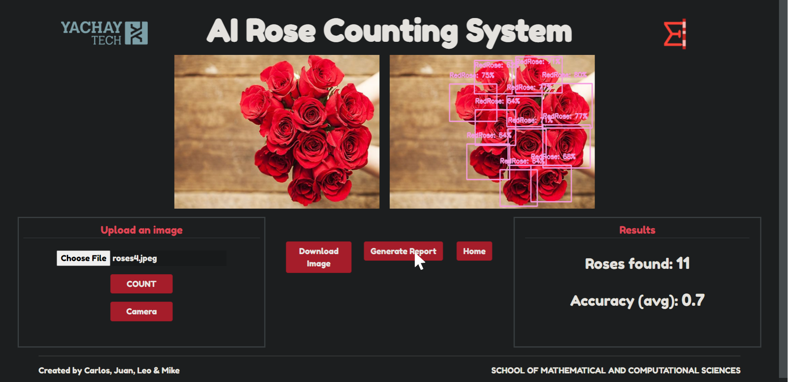


* In the new window, you can download the report by clicking on the "Download report" button.

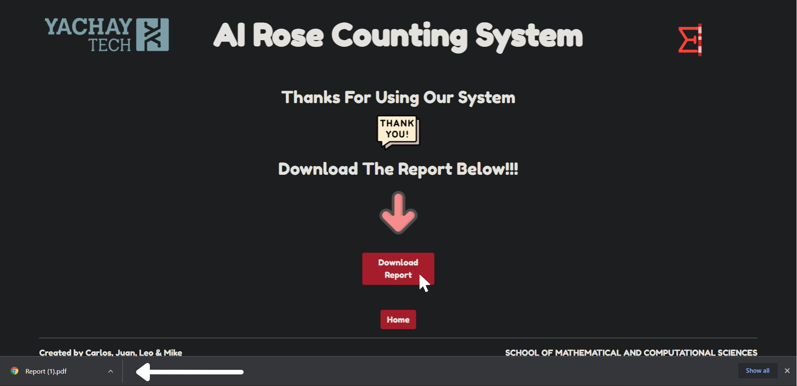
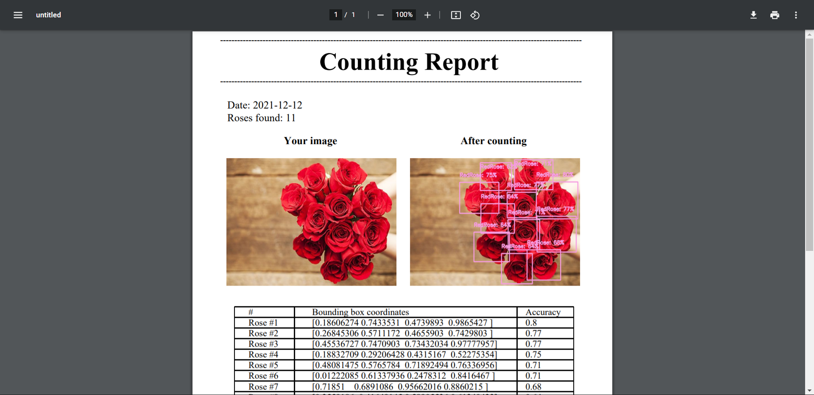

* Finally, you can go to the home page to process another image

<p align="right">(<a href="#top">back to top</a>)</p>

### Counting using the camera

* Click on the "Camera" button

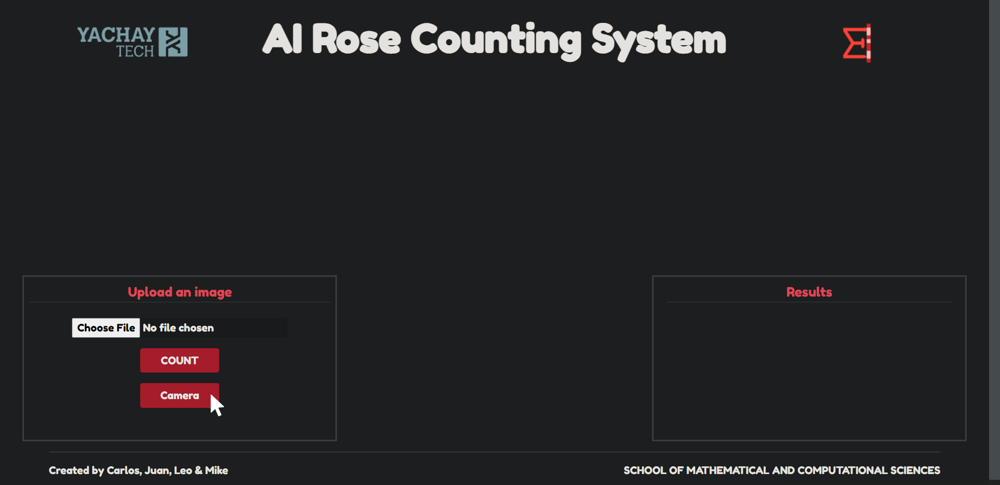

* Give permissions to access your camera

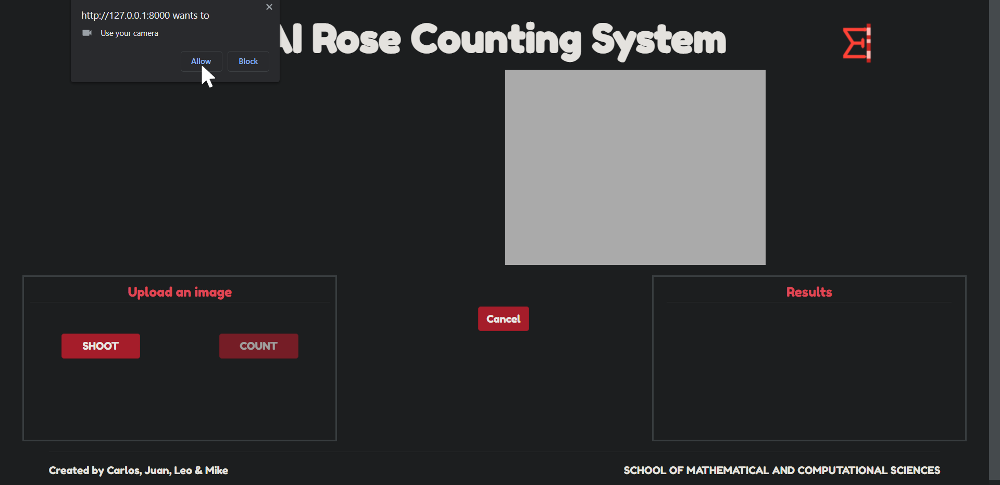

* Then, a box with the image of your camera will be displayed.

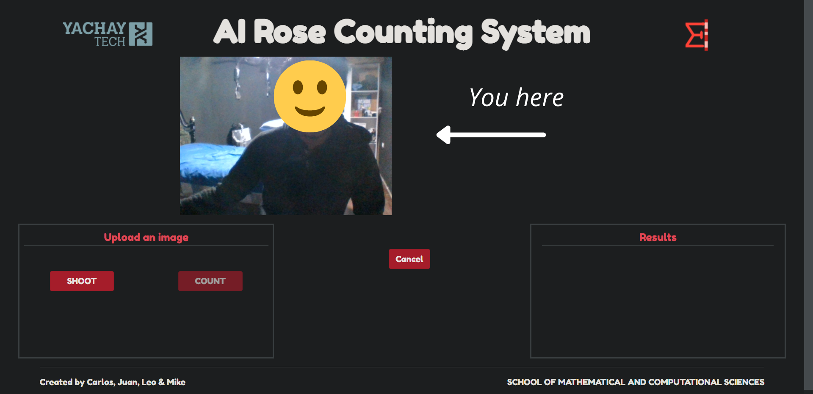

* Place the desired image in front of the lens and press the "Shoot" button to capture it. (_You can click the "Shoot" button as many times as you wish until you capture the right image._)

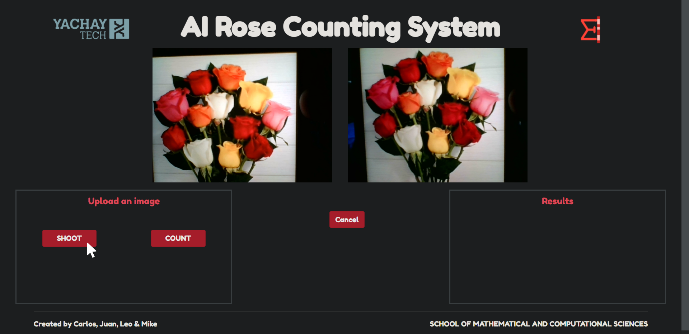

* Once the image is captured, click on the "Count" button to start counting. 


* A waiting screen will be displayed while your image is being processed. (_You can cancel the process at any time by clicking the "Cancel" button._)


* After a few seconds, the original image will be displayed on the screen together with the image with the rose detection. Also, the number of roses found and the average accuracy will be displayed in the results panel.


* If you wish, you can download the resulting image by clicking on the "Download Image" button.

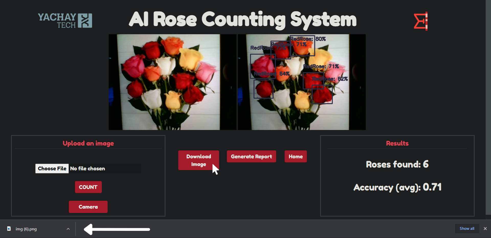


* You can also generate a report of the count by clicking on the "Generate report" button, which will take you to a new window.

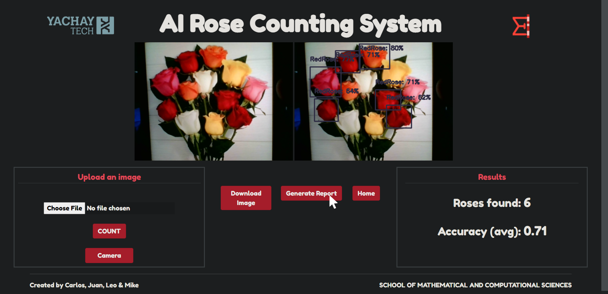


* In the new window, you can download the report by clicking on the "Download report" button.


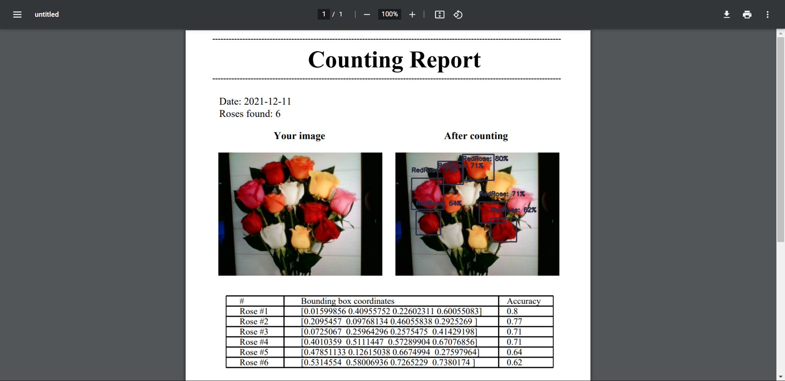

* Finally, you can go to the home page to process another image

<p align="right">(<a href="#top">back to top</a>)</p>

<!-- CONTACT -->
## Contact

Leo Ramos - [LinkedIn](https://www.linkedin.com/in/leo-thomas-ramos/) - leo.ramos@yachaytech.edu.ec

Mike Bermeo - [LinkedIn](https://www.linkedin.com/in/mike-bermeo-1a8869128/) - mike.bermeo@yachaytech.edu.ec

Juan Brito - [LinkedIn](http://www.linkedin.com/in/juan-brito-a93497b9) - juan.brito@yachaytech.edu.ec

Carlos Macancela - [LinkedIn](https://www.linkedin.com/in/leo-thomas-ramos/) - carlos.macancela@yachaytech.edu.ec

<br>
<br>

Project Link (main project): [https://github.com/Leo-Thomas/Yachay-Tech-object-detection-projects.git](https://github.com/Leo-Thomas/Yachay-Tech-object-detection-projects.git)

Project Link (web app project only): [https://github.com/Leo-Thomas/AI-based-red-rose-counting-webapp.git](https://github.com/Leo-Thomas/AI-based-red-rose-counting-webapp.git)

<p align="right">(<a href="#top">back to top</a>)</p>


<!-- ACKNOWLEDGMENTS -->
## Acknowledgments

* [IBM MAX Object Detector](https://github.com/IBM/MAX-Object-Detector-Web-App)
* [TFJS Object Detection](https://github.com/eisbilen/TFJS-ObjectDetection)
* [Piotr Płoński](https://www.deploymachinelearning.com/)
* [Towards Data Science](https://towardsdatascience.com/creating-a-machine-learning-based-web-application-using-django-5444e0053a09)

<p align="right">(<a href="#top">back to top</a>)</p>
<!--Links-->

[product-screenshot]: Images/product.png
